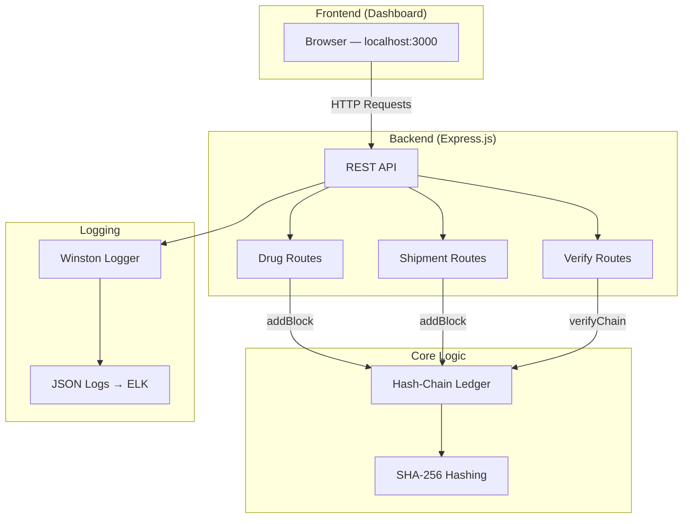
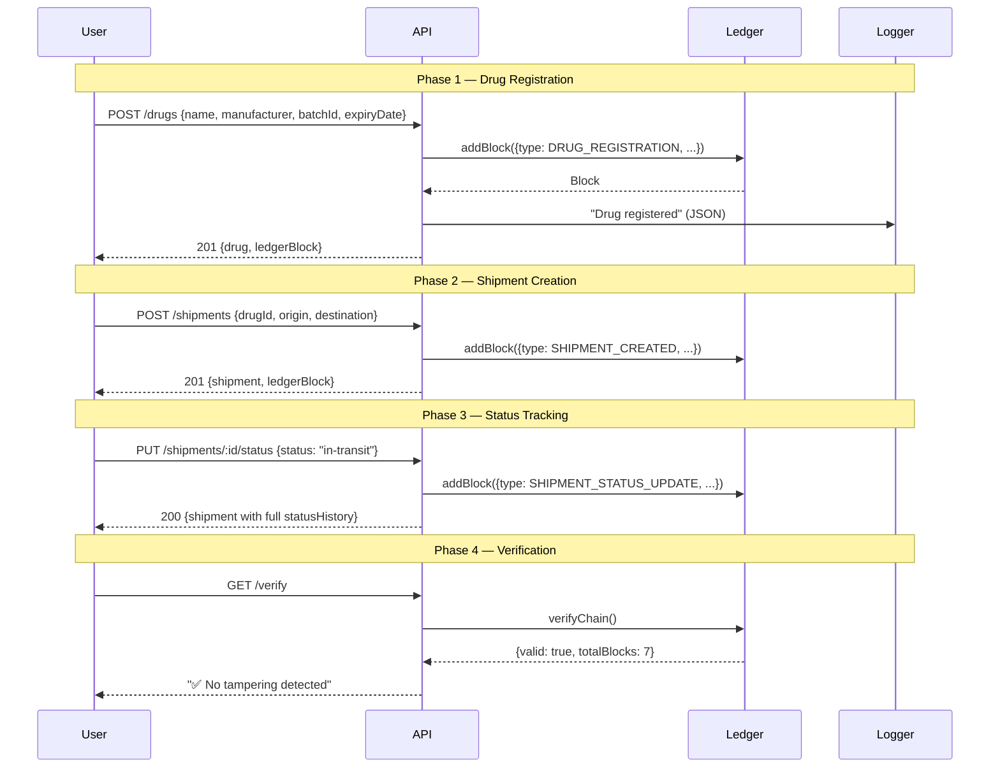
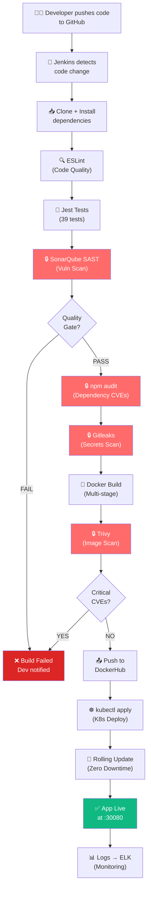

# Pharma Supply Chain — Complete Project Walkthrough

## Table of Contents

1. [How the Application Works](#1-how-the-application-works)
2. [Demo Run Output](#2-demo-run-output)
3. [Jenkins Setup (Step-by-Step)](#3-jenkins-setup-step-by-step)
4. [Kubernetes Setup (Step-by-Step)](#4-kubernetes-setup-step-by-step)
5. [End-to-End DevSecOps Flow](#5-end-to-end-devsecops-flow)

---

## 1. How the Application Works

### Architecture



### Core Concept: Hash-Chain Ledger

The application uses an **immutable hash-chain** (similar to a simplified blockchain) to detect tampering:

```
Block 0 (GENESIS)           Block 1 (DRUG_REG)          Block 2 (SHIPMENT)
┌─────────────────┐         ┌─────────────────┐         ┌─────────────────┐
│ prevHash: "0"   │         │ prevHash: hash₀ │         │ prevHash: hash₁ │
│ data: GENESIS   │────────▶│ data: Aspirin   │────────▶│ data: Shipment  │
│ hash: hash₀     │         │ hash: hash₁     │         │ hash: hash₂     │
└─────────────────┘         └─────────────────┘         └─────────────────┘
```

**How it works:**
1. Every action (drug registration, shipment creation, status update) creates a new **block**
2. Each block's hash = `SHA-256(previousHash + data + timestamp)`
3. Blocks are linked: each block stores the hash of the previous block
4. If anyone modifies a block's data, its hash changes → breaks the link to the next block
5. `GET /verify` re-computes every hash and detects any broken links = **counterfeit detection**

### API Workflow



---

## 2. Demo Run Output

Here's the actual output from running the application:

### Step 1: Health Check
```bash
$ curl http://localhost:3000/health
{
    "status": "healthy",
    "service": "pharma-supply-chain",
    "uptime": 0.965,
    "timestamp": "2026-04-27T09:47:46.336Z"
}
```

### Step 2: Register Aspirin
```bash
$ curl -X POST http://localhost:3000/drugs \
  -H "Content-Type: application/json" \
  -d '{"name":"Aspirin","manufacturer":"PharmaCorp India","batchId":"BATCH-2026-001","expiryDate":"2026-12-31"}'

# Response: Drug created + recorded in ledger as Block #1
{
    "message": "Drug registered successfully",
    "drug": { "id": "fe108233-...", "name": "Aspirin", "status": "registered" },
    "ledgerBlock": { "index": 1, "hash": "27643387fc582774..." }
}
```

### Step 3-4: Register Amoxicillin + List All Drugs
```bash
$ curl http://localhost:3000/drugs
{
    "count": 2,
    "drugs": [
        { "name": "Aspirin", "manufacturer": "PharmaCorp India", "batchId": "BATCH-2026-001" },
        { "name": "Amoxicillin", "manufacturer": "MedPharma Ltd", "batchId": "BATCH-2026-002" }
    ]
}
```

### Step 5: Create Shipment
```bash
$ curl -X POST http://localhost:3000/shipments \
  -d '{"drugId":"fe108233-...","drugName":"Aspirin","origin":"Mumbai Warehouse","destination":"Delhi Hospital","quantity":500}'

# Response: Shipment created with status "created" + Block #3
```

### Step 6-8: Track Shipment Through Supply Chain
```bash
# Step 6: In Transit
$ curl -X PUT http://localhost:3000/shipments/SHIPMENT_ID/status \
  -d '{"status":"in-transit","location":"Highway NH-48"}'          # → Block #4

# Step 7: At Checkpoint
$ curl -X PUT ... -d '{"status":"at-checkpoint","location":"Rajasthan Border"}'  # → Block #5

# Step 8: Delivered
$ curl -X PUT ... -d '{"status":"delivered","location":"Delhi Hospital Dock"}'    # → Block #6
```

### Step 9: Full Shipment History
```bash
$ curl http://localhost:3000/shipments/SHIPMENT_ID
{
    "shipment": {
        "status": "delivered",
        "statusHistory": [
            { "status": "created",       "location": "Mumbai Warehouse" },
            { "status": "in-transit",    "location": "Highway NH-48" },
            { "status": "at-checkpoint", "location": "Rajasthan Border Checkpoint" },
            { "status": "delivered",     "location": "Delhi Hospital Receiving Dock" }
        ]
    }
}
```

### Step 10: Verify Chain Integrity ✅
```bash
$ curl http://localhost:3000/verify
{
    "message": "✅ Supply chain integrity verified — no tampering detected",
    "verification": { "valid": true, "totalBlocks": 7, "invalidBlocks": [] }
}
```

### Step 11: View Full Ledger
```
Total Blocks: 7
============================================================
Block #0 | GENESIS
  Hash: aee8f3927f1b5bfa3b27c94e9db63f15ebef02d9...
  Prev: 0

Block #1 | DRUG_REGISTRATION     ← Aspirin
  Hash: 27643387fc582774b20d3d982553283ccce043f2...
  Prev: aee8f3927f1b5bfa3b27c94e9db63f15ebef02d9...

Block #2 | DRUG_REGISTRATION     ← Amoxicillin
  Hash: 10b1dfcf72ddae5468840d605dd89f3e3b5110fa...

Block #3 | SHIPMENT_CREATED      ← Mumbai → Delhi
  Hash: 4f38f293ab4a9378ddde1a19d7b8bc64dd39f3d5...

Block #4 | SHIPMENT_STATUS_UPDATE ← In Transit
Block #5 | SHIPMENT_STATUS_UPDATE ← At Checkpoint
Block #6 | SHIPMENT_STATUS_UPDATE ← Delivered
```

> [!IMPORTANT]
> Every block's `Prev` hash matches the previous block's `Hash` — proving the chain is intact. If anyone modifies Block #1's data (e.g., changes the drug name), Block #1's hash would change, breaking the link from Block #2 → tampering detected!

---

## 3. Jenkins Setup (Step-by-Step)

### Prerequisites
- Docker installed and running
- DockerHub account (free)

### Step 1: Run Jenkins in Docker

```bash
# Create a Docker network for Jenkins + SonarQube
docker network create jenkins-net

# Run Jenkins (Choose Option A for Apple Silicon/ARM64 Mac, Option B for x86_64)

# Option A: Build and Run Custom Jenkins (Recommended for Apple Silicon / ARM64)
# (Includes libatomic1 required by modern Node.js versions on aarch64)
docker build -t custom-jenkins -f docker/Dockerfile.jenkins .

docker run -d \
  --name jenkins \
  --network jenkins-net \
  -p 8080:8080 -p 50000:50000 \
  -v jenkins_home:/var/jenkins_home \
  -v /var/run/docker.sock:/var/run/docker.sock \
  custom-jenkins

# Option B: Run Standard Jenkins
# (If using this on Apple Silicon, run: docker exec -u 0 jenkins apt-get update && docker exec -u 0 jenkins apt-get install -y libatomic1)
# docker run -d \
#   --name jenkins \
#   --network jenkins-net \
#   -p 8080:8080 -p 50000:50000 \
#   -v jenkins_home:/var/jenkins_home \
#   -v /var/run/docker.sock:/var/run/docker.sock \
#   jenkins/jenkins:lts-jdk17

# Get the initial admin password
docker exec jenkins cat /var/jenkins_home/secrets/initialAdminPassword
```

### Step 2: Initial Jenkins Configuration

1. Open **http://localhost:8080** in your browser
2. Paste the initial admin password from Step 1
3. Click **"Install suggested plugins"** — wait for installation
4. Create an admin user (e.g., `admin` / `admin123`)
5. Set Jenkins URL to `http://localhost:8080`
6. Click **"Start using Jenkins"**

### Step 3: Install Required Plugins

Go to **Manage Jenkins → Plugins → Available plugins** and install:

| Plugin | Purpose |
|--------|---------|
| **Pipeline** | Pipeline-as-code support (usually pre-installed) |
| **Docker Pipeline** | Docker build/push from pipeline |
| **SonarQube Scanner** | SAST integration |
| **HTML Publisher** | Coverage report display |
| **NodeJS** | Node.js tool installer |

Click **"Install without restart"** → check **"Restart Jenkins"** after install.

### Step 4: Configure Tools

Go to **Manage Jenkins → Tools**:

#### NodeJS
1. Click **"Add NodeJS"**
2. Name: `NodeJS-26`
3. Version: `NodeJS 26.x`
4. Click **Save**

#### SonarQube Scanner
1. Click **"Add SonarQube Scanner"**
2. Name: `SonarQubeScanner`
3. Check **"Install automatically"**
4. Click **Save**

### Step 5: Run SonarQube

```bash
# Run SonarQube Community Edition
docker run -d \
  --name sonarqube \
  --network jenkins-net \
  -p 9000:9000 \
  -e SONAR_ES_BOOTSTRAP_CHECKS_DISABLE=true \
  sonarqube:community

# Wait ~2 minutes for startup, then open http://localhost:9000
# Default login: admin / admin (you'll be asked to change it)
```

### Step 6: Connect Jenkins to SonarQube

**In SonarQube (http://localhost:9000):**
1. Go to **Administration → Security → Users**
2. Click the **token icon** for your user → Generate a token named `jenkins`
3. Copy the token

**In Jenkins (http://localhost:8080):**
1. Go to **Manage Jenkins → Credentials → System → Global credentials**
2. Click **"Add Credentials"**
3. Kind: **Secret text**
4. Secret: paste the SonarQube token
5. ID: `sonarqube-token`

Then go to **Manage Jenkins → System → SonarQube servers**:
1. Check **"Environment variables"**
2. Name: `SonarQube`
3. Server URL: `http://sonarqube:9000` (uses Docker network name)
4. Server authentication token: select `sonarqube-token`
5. Click **Save**

### Step 7: Add DockerHub Credentials

1. Go to **Manage Jenkins → Credentials → System → Global credentials**
2. Click **"Add Credentials"**
3. Kind: **Username with password**
4. Username: your DockerHub username
5. Password: your DockerHub password or access token
6. ID: `dockerhub-credentials`
7. Click **Save**

### Step 8: Create the Pipeline Job

1. Click **"New Item"** from the Jenkins dashboard
2. Name: `pharma-supply-chain`
3. Type: **Pipeline**
4. Click **OK**

In the Pipeline configuration:
1. Under **Pipeline**, set:
   - Definition: **Pipeline script from SCM**
   - SCM: **Git**
   - Repository URL: `https://github.com/Abhi-3009/pharma-devops-project.git`
   - Branch: `*/main`
   - Script Path: `jenkins/Jenkinsfile`
2. Click **Save**

### Step 9: Run the Pipeline

1. Click **"Build Now"**
2. Watch the pipeline stages execute:

```
✅ Clone Repository
✅ Install Dependencies
✅ Lint (ESLint)
✅ Unit Tests (Jest + Coverage)
🔒 SAST (SonarQube) ← Security Gate
🔒 Dependency Scan   ← Security Gate
🔒 Secrets Detection ← Security Gate
✅ Docker Build
🔒 Image Scan (Trivy) ← Security Gate
✅ Push to DockerHub
✅ Deploy to Kubernetes
```

3. Click on any stage to see its logs
4. View the SonarQube dashboard at http://localhost:9000 for SAST results

### Step 10: Install Security Tools on Jenkins

```bash
# Enter the Jenkins container
docker exec -it --user root jenkins bash

# Install Docker CLI (for building images)
apt-get update && apt-get install -y docker.io

# Install Trivy (container image scanner)
apt-get install -y wget apt-transport-https gnupg lsb-release
wget -qO - https://aquasecurity.github.io/trivy-repo/deb/public.key | apt-key add -
echo "deb https://aquasecurity.github.io/trivy-repo/deb generic main" | tee /etc/apt/sources.list.d/trivy.list
apt-get update && apt-get install -y trivy

# Install Gitleaks (secrets detection)
wget https://github.com/gitleaks/gitleaks/releases/download/v8.18.0/gitleaks_8.18.0_linux_x64.tar.gz
tar -xzf gitleaks_8.18.0_linux_x64.tar.gz -C /usr/local/bin/
rm gitleaks_8.18.0_linux_x64.tar.gz

exit
```

---

## 4. Kubernetes Setup (Step-by-Step)

### Prerequisites
- Docker installed and running
- Minikube installed (`brew install minikube`)
- kubectl installed (`brew install kubectl`)

### Step 1: Start Minikube

```bash
# Start a local Kubernetes cluster
minikube start --driver=docker --cpus=2 --memory=4096

# Verify it's running
kubectl cluster-info
minikube status
```

**Expected output:**
```
Kubernetes control plane is running at https://192.168.49.2:8443
CoreDNS is running at https://192.168.49.2:8443/api/v1/...

minikube
type: Control Plane
host: Running
kubelet: Running
apiserver: Running
```

### Step 2: Create Namespace

```bash
kubectl apply -f k8s/namespace.yaml
# Output: namespace/pharma-app created

kubectl get namespaces
# You should see "pharma-app" in the list
```

### Step 3: Build and Load Docker Image

```bash
# Option A: Use Minikube's Docker daemon (no DockerHub needed)
eval $(minikube docker-env)
docker build -t pharma-supply-chain:latest -f docker/Dockerfile .

# Option B: Pull from DockerHub (if image was pushed by Jenkins)
# Edit k8s/deployment.yaml → image: your-dockerhub-username/pharma-supply-chain:latest
```

> [!TIP]
> For local development, Option A is faster — it builds the image directly inside Minikube's Docker, so no push/pull needed.

### Step 4: Update Deployment Manifest (if using local image)

If using Option A (local build), edit [deployment.yaml](file:///Users/abhijeetrai/Desktop/spe-major-proj/k8s/deployment.yaml):

```yaml
containers:
  - name: pharma-app
    image: pharma-supply-chain:latest      # ← local image name
    imagePullPolicy: Never                 # ← ADD THIS LINE (uses local image)
```

### Step 5: Deploy the Application

```bash
# Apply the deployment
kubectl apply -f k8s/deployment.yaml
# Output: deployment.apps/pharma-app created

# Apply the service
kubectl apply -f k8s/service.yaml
# Output: service/pharma-app-service created
```

### Step 6: Verify Deployment

```bash
# Check pods are running
kubectl get pods -n pharma-app
# Expected:
# NAME                          READY   STATUS    RESTARTS   AGE
# pharma-app-xxxxx-yyyyy        1/1     Running   0          30s
# pharma-app-xxxxx-zzzzz        1/1     Running   0          30s

# Check deployment status
kubectl get deployments -n pharma-app
# Expected:
# NAME         READY   UP-TO-DATE   AVAILABLE   AGE
# pharma-app   2/2     2            2            45s

# Check service
kubectl get svc -n pharma-app
# Expected:
# NAME                  TYPE       CLUSTER-IP     PORT(S)          AGE
# pharma-app-service    NodePort   10.96.x.x      3000:30080/TCP   30s
```

### Step 7: Access the Application

```bash
# Get the URL to access the app
minikube service pharma-app-service -n pharma-app --url
# Output: http://192.168.49.2:30080

# Or open directly in browser
minikube service pharma-app-service -n pharma-app
```

### Step 8: Test the Deployed App

```bash
APP_URL=$(minikube service pharma-app-service -n pharma-app --url)

# Health check
curl $APP_URL/health

# Register a drug
curl -X POST $APP_URL/drugs \
  -H "Content-Type: application/json" \
  -d '{"name":"Aspirin","manufacturer":"PharmaCorp","batchId":"K8S-001","expiryDate":"2027-01-01"}'

# Verify chain
curl $APP_URL/verify
```

### Step 9: Useful Kubernetes Commands

```bash
# View pod logs
kubectl logs -f deployment/pharma-app -n pharma-app

# Scale up/down
kubectl scale deployment pharma-app -n pharma-app --replicas=3

# Rolling update (after new image build)
kubectl rollout restart deployment/pharma-app -n pharma-app

# Check rollout status
kubectl rollout status deployment/pharma-app -n pharma-app

# Delete everything
kubectl delete -f k8s/service.yaml
kubectl delete -f k8s/deployment.yaml
kubectl delete -f k8s/namespace.yaml
```

### Step 10: Kubernetes Dashboard (Optional)

```bash
# Enable the dashboard addon
minikube addons enable dashboard
minikube addons enable metrics-server

# Open the dashboard
minikube dashboard
# This opens a web browser with the K8s dashboard
# Navigate to Namespace: pharma-app to see your deployment
```

---

## 5. End-to-End DevSecOps Flow

### What Happens When You Push Code



### Security at Every Stage

| Stage | What's Checked | Tool | Fail Criteria |
|-------|---------------|------|---------------|
| **Code** | Dangerous patterns like `eval()`, `no-var` | ESLint | Errors |
| **Test** | All 39 tests must pass | Jest | Any failure |
| **SAST** | SQL injection, XSS, insecure crypto, code smells | SonarQube | Critical/High bugs |
| **Dependencies** | Known CVEs in npm packages | npm audit | High severity |
| **Secrets** | API keys, passwords, tokens committed to code | Gitleaks | Any detection |
| **Container** | OS/library CVEs in the Docker image | Trivy | Critical severity |
| **Runtime** | Request logging, anomaly detection | ELK Stack | — (monitoring) |
| **Infrastructure** | Non-root user, resource limits, probes | K8s | — (enforcement) |

### How Each Security Tool Works

#### SonarQube (SAST)
- Analyzes source code **without running it**
- Detects: SQL injection, XSS, insecure cryptography, code smells
- Dashboard at `http://localhost:9000` shows findings with severity ratings
- Pipeline breaks if quality gate fails (Critical/High issues)

#### npm audit (Dependency Scan)
- Checks every package in `node_modules` against the **npm vulnerability database**
- Reports CVEs with severity levels (low/moderate/high/critical)
- Pipeline breaks on high-severity findings

#### Gitleaks (Secrets Detection)
- Scans the entire Git history for patterns matching secrets
- Detects: API keys, AWS credentials, database passwords, JWT tokens
- Uses regex rules defined in [.gitleaks.toml](file:///Users/abhijeetrai/Desktop/spe-major-proj/.gitleaks.toml)
- Pipeline breaks on **any** detection (zero tolerance for leaked secrets)

#### Trivy (Container Image Scan)
- Scans the built Docker image for OS-level and library vulnerabilities
- Checks Alpine Linux packages + Node.js dependencies inside the container
- Pipeline breaks on critical-severity CVEs

---

## Quick Reference

### Run Locally
```bash
cd app && npm install && npm start     # → http://localhost:3000
```

### Run Tests
```bash
cd app && npm test                      # 39 tests
cd app && npm run lint                  # ESLint
```

### Docker
```bash
docker build -t pharma-app -f docker/Dockerfile .
docker run -p 3000:3000 pharma-app      # → http://localhost:3000
```

### Kubernetes
```bash
minikube start
kubectl apply -f k8s/namespace.yaml
kubectl apply -f k8s/deployment.yaml
kubectl apply -f k8s/service.yaml
minikube service pharma-app-service -n pharma-app
```

### ELK Stack
```bash
cd elk && docker-compose up -d          # Kibana → http://localhost:5601
```

### Jenkins
```bash
# Build custom image to include libatomic1 (ARM64 support)
docker build -t custom-jenkins -f docker/Dockerfile.jenkins .

docker run -d --name jenkins -p 8080:8080 custom-jenkins
# → http://localhost:8080
```
